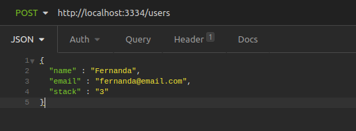
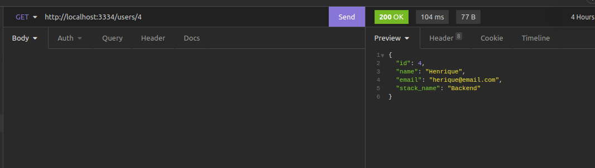
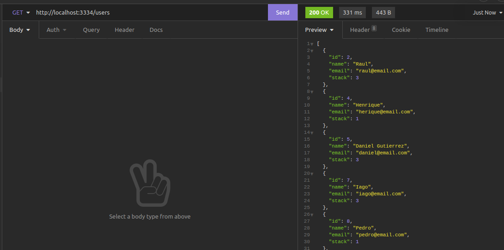
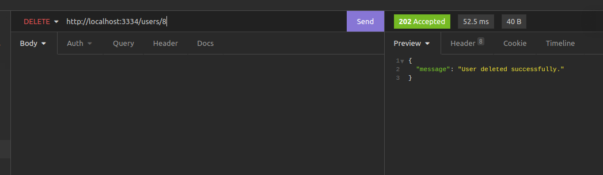
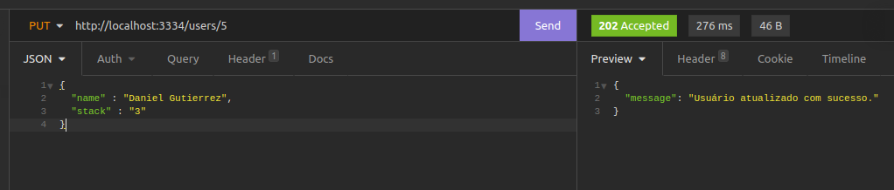

Projeto criação, listagem, deleção e alteração de usuário com a linguagem Nodejs.

Para testar a API basta seguir o passo a passo.

Será necessário ter instalado em sua máquina os seguintes programas Nodejs, Insominia ou Postman e também o Banco de dados Postgres.

Insomnia - https://insomnia.rest/download
Insominia como usar - https://www.youtube.com/watch?v=gLpw0GSDYaw

NodeJs - https://nodejs.org/en/download/ 

1º - Baixar o NodeJs em sua máquina.

2º - Clonar este repositório ou fazer o download.

3º - É necessário ter o banco de dados POSTGRES instalado em sua máquina, segue o link da pagina de download https://www.postgresql.org/download/, selecione a versão de seu sistema operacional, para realizar a configuração encontrei este vídeo para auxílio https://www.youtube.com/watch?v=His77sqWfGU ;

4º - Após clonar o repositório haverá um arquivo chamado SCHEMA.DB, nele há o necessário para reproduzir a tabela para a execução da API.

5º - Após a instalação e configuração do banco de dados basta criar o arquivo .env no diretório(pasta) raiz da API e colocar as credenciais de seu banco de dados, como no .env.example, após a criação do arquivo .env e configuração, basta abrir o terminal ou prompt de comando e usar o comando "npm i" na pasta da api e logo em seguida executar o comando "npm dev" para subir o servidor.

6º Para de fato testar a API, o servidor deve estar de pé(no caso o coamndo "npm dev" deve estar sendo executado em um terminal) abra o Insomnia ou Postman e na porta "http://localhost".

Endpoints para testes: 

http://localhost:3334/users

http://localhost:3334/users/1

Neste projeto há 5 endpoints: Criação de usuário, Listagem de todos os usuários, Listagem de um usuário específico, remoção de um usuário e alteração de um usuário.
Quando se trata de usuário específico deve passar o ID desejado na rota(url) como no segunto exemplo do endpoint nos demais casos não é necessário.

Exemplo de criação de um usuário:

Exemplo de Listagem de um usuário específico: 

Exemplo de listagem de todos os usuários: 

Exemplo de remoção de um usuário:

Exemplo de alteração de um usuário:
